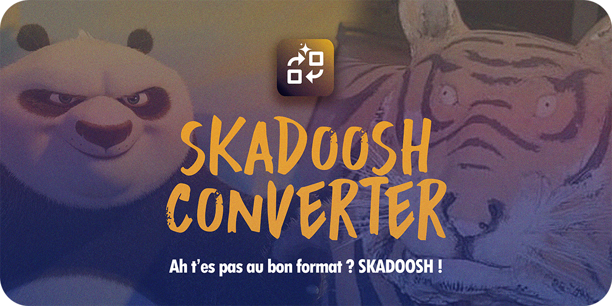

  

  
  
  
  

# Skadoosh converter

MArre d'envoyer vos fichiers sur des serveurs chelous pour qu'ils soient convertis ? Nationalisez la conversion de vos fichiers avec SKADOOSH, un utilitaire bête et méchant qui change vos extensions et convertit localement !

> [!WARNING]
> **Avertissement lié à l'IA**
>
> Je suis ingé logiciel web, et ça se limite à ça. Ce logiciel a été créé en grande partie avec le support de l'IA, puis débuggué manuellement et vérifié sous toutes les coutures. Ce projet est un projet fun, non pas un projet à visée performative ou professionnelle - traitez-le en conséquence, et continuez d'avoir un usage prudent et raisonnable des outils d'intelligence artificielle.

## Installation

> [!WARNING]
> **Votre antivirus va gueuler**
>
> Qui a 300 balles à lâcher par an pour un certificat d'authentification de l'app ? Pas moi, en tous cas. Lorsque vous téléchargerez ou installerez l'app, vous aurez probablement un avertissement. Soyez fermes avec lui !

### En standalone

Téléchargez l'utilitaire d'installation "setup" selon votre plateforme (windows/mac). L'installeur va décompiler l'app **dans le dossier dans lequel il se trouve**, mais vous pourrez bouger le dossier de l'app où vous le souhaitez.

Cliquez ensuite sur l'icône et c'est parti.

Au lancement, Skadoosh va télécharger les **dépendances**, c'est à dire de petits scripts de lecture de formats de fichier dont vous aurez besoin pour la conversion.

* FFmpeg (audios)
* ImageMagik (images modernes)
* Pandoc (documents texte)
* Typst (Textes vers PDF)

### Dans Stargazer

Voir Stargazer Hub.

  

